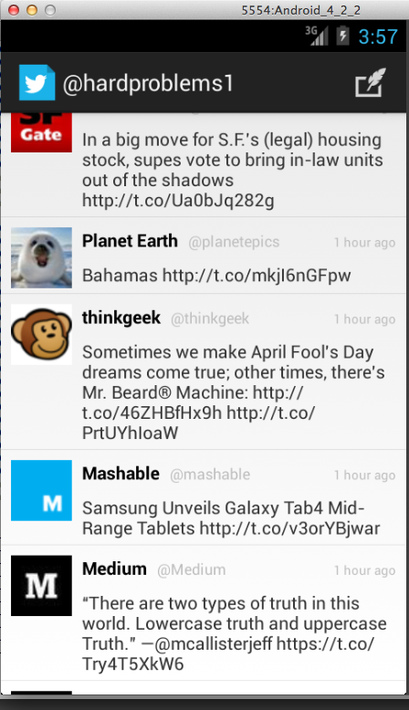
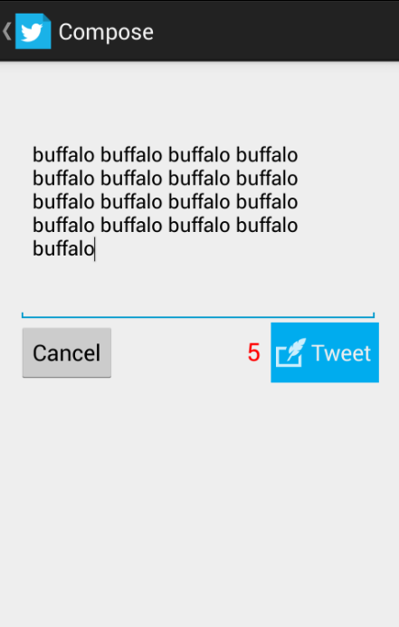

SimpleTwitterClient
===================

**Implemented User Stories**

	User can sign in using OAuth login flow
	User can view last 25 tweets from their home timeline
    User should be able to see the user, body and timestamp for tweet
    User should be displayed the relative timestamp for a tweet "8m", "7h"
    ~~Optional: Links in tweets are clickable and viewable~~
	User can load more tweets once they reach the bottom of the list using "infinite scroll" pagination
	User can compose a new tweet
    User can click a “Compose” icon in the Action Bar on the top right
    User will have a Compose view opened
    User can enter a message and hit a button to post to twitter
    User should be taken back to home timeline with new tweet visible
    Optional: User can see a counter with total number of characters left for tweet

	Optional: User can refresh tweets timeline by pulling down to refresh (i.e pull-to-refresh)
	~~Optional: User can open the twitter app offline and see last loaded tweets~~
    ~~Tweets are persisted into sqlite and can be displayed from the local DB~~

	Optional: Improve the user interface and theme the app to feel twitter branded

**Screenshots:**

